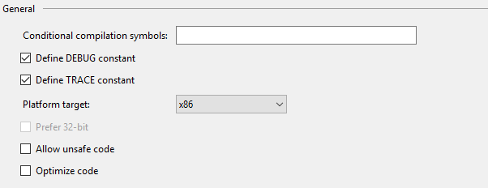
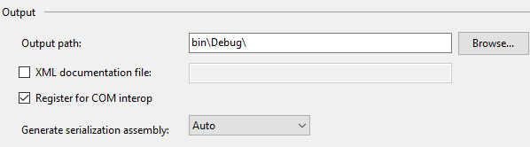

# QlikSenseEpic2015DLL
A dll that works with [QSTicketEpicModule](https://github.com/eapowertools/QSTicketEpicModule) to integrate Qlik Sense authentication with Epic Hyperspace.

The dll communicates with Epic Hyperspace to take settings from the application and make a request for Qlik Sense resources embedded in Epic.  If the user is not authenticated, the dll sends an encrypted token to the [QSTicketEpicModule](https://github.com/eapowertools/QSTicketEpicModule) for authentication to Qlik Sense.

##Requirements
- Qlik Sense Enterprise Server 2.2.4 and above
- Epic Hyperspace 2015 (version 8.2)

##Prerequisites
- [QSTicketEpicModule](https://github.com/eapowertools/QSTicketEpicModule): This solution implements the authentication scheme Epic will use to complete the handshake between Epic and Qlik Sense.  QSTicketEpicModule is installed on the Qlik Sense server.

##Installation (compiling source)
1. Download the source by clicking the link above.
2. Fire up Visual Studio and open the project.
3. Right click on the QlikSenseEpic2015 project and choose properties.
4. In the properties panel, click on the Build tab.
5. In the general section for the Build, make sure x86 is set for the Platform target.

6. In the output section for the Build, make sure the Register for COM interop box is checked.

7. Build the solution.
8. Copy/Paste the DLL to a folder on the system where Epic Hyperspace is installed.
9. Open a command prompt with administrator privileges and navigate to the folder the DLL was pasted to.
10. Run the following command line: `C:\Windows\Microsoft.NET\Framework\v4.0.30319\regasm.exe QlikSenseEpic2015.dll /tlb /codebase`.  This command will register the DLL in the system registry and create a tlb file for Epic to use when loading the DLL. 
11. Navigate to the shared file folder location for Epic Hyperspace and create a file named `qliksenseepic2015.config`.
12. Open the `qliksenseepic2015.config` file and in the first line add `key=` and then a passphrase the dll will use to encrypt the userid of the user when transmitting to the Qlik Sense server.
13. Save the file.  The DLL is now installed and configured.
14. Restart Epic Hyperspace if it is currently running before attempting to connect to Qlik Sense using the DLL.

##Installation (using release package)
1. Download the zip package [QlikSenseEpic2015.zip](https://github.com/eapowertools/QlikSenseEpic2015DLL/releases/download/RC1/QlikSenseEpic2015.zip).
2. Unzip the file in the location you want the DLL file to reside.
3. Open a command prompt with administrator privileges and navigate to the folder where the package was unzipped.
4. In the command window run the batch file by typing in `registerthedll.bat`.  The result of running the command is the command window below.

5. Cut the file `qliksenseepic2015.config` and paste it in the shared file folder location for Epic Hyperspace.
6. Open the `qliksenseepic2015.config` and set the passphrase (after `key=`) for encrypting userid of the user when transmitting to the Qlik Sense server.
7. Save the file.  The DLL is now installed and configured.
8. Restart Epic Hyperspace if it is currently running before attempting to connect to Qlik Sense using the DLL.
